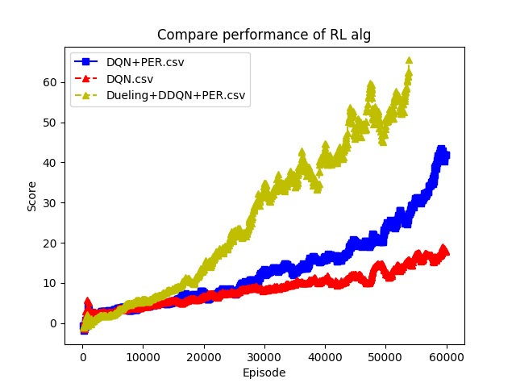

# Graph Visaulize

### description
Result compare 

### How to use
1. Using Tensorbard and create csv file.
2. change file name. (file name will be label. ex. DDQN+PER.csv)
3. run this script using param. (ex. python GraphViewer.py ./logs)

### TO-DO
1. graph color and pattern add.

#Example Graph
